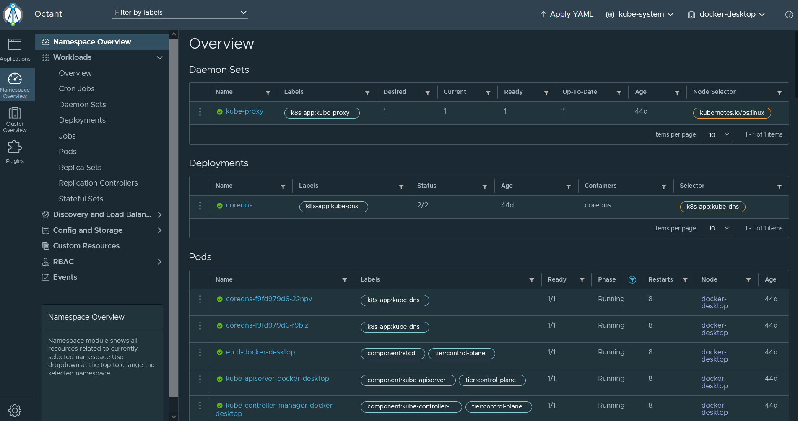
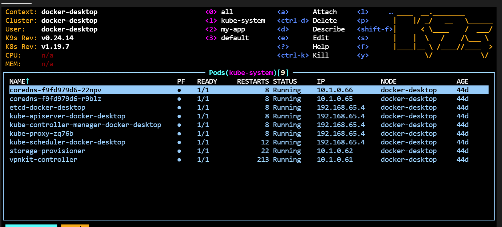

<br><br>
<br><br>
<br><br>

# Installing tools

## LAB Overview


1. Kubectl plugins

https://krew.sigs.k8s.io/docs/user-guide/setup/install/

```console
krew install krew
```
<pre>
←[31;1mWARNING: ←[0mTo be able to run kubectl plugins, you need to add the
"%USERPROFILE%\.krew\bin" directory to your PATH environment variable
and restart your shell.
</pre>

```console kubectl krew version```

<pre>
OPTION            VALUE
GitTag            v0.4.0
GitCommit         8bebb56
IndexURI          https://github.com/kubernetes-sigs/krew-index.git
BasePath          C:\Users\User\.krew
IndexPath         C:\Users\User\.krew\index\default
InstallPath       C:\Users\User\.krew\store
BinPath           C:\Users\User\.krew\bin
DetectedPlatform  windows/amd64
</pre>

```console kubectl krew search ```

```console kubectl krew install get-all```

<pre>
Updated the local copy of plugin index.
Installing plugin: get-all
Installed plugin: get-all
\
 | Use this plugin:
 |      kubectl get-all
 | Documentation:
 |      https://github.com/corneliusweig/ketall
/
←[31;1mWARNING: ←[0mYou installed plugin "get-all" from the krew-index plugin repository.
   These plugins are not audited for security by the Krew maintainers.
   Run them at your own risk.
←[1mA newer version of krew is available (v0.4.0 -> v0.4.1).
Run "kubectl krew upgrade" to get the newest version!
←[0m
</pre>

```console kubectl krew install  change-ns ```
<pre>

Updated the local copy of plugin index.
Installing plugin: change-ns
Installed plugin: change-ns
\
 | Use this plugin:
 |      kubectl change-ns
 | Documentation:
 |      https://github.com/juanvallejo/kubectl-ns
/
←[31;1mWARNING: ←[0mYou installed plugin "change-ns" from the krew-index plugin repository.
   These plugins are not audited for security by the Krew maintainers.
   Run them at your own risk
</pre>

```console kubectl krew install split-yaml ```

<pre>
Updated the local copy of plugin index.
Installing plugin: split-yaml
Installed plugin: split-yaml
\
 | Use this plugin:
 |      kubectl split-yaml
 | Documentation:
 |      https://github.com/nathforge/kubectl-split-yaml
/
←[31;1mWARNING: ←[0mYou installed plugin "split-yaml" from the krew-index plugin repository.
   These plugins are not audited for security by the Krew maintainers.
   Run them at your own risk.
</pre>
```console kubectl krew search neat ```
<pre>
NAME          DESCRIPTION                                         INSTALLED
neat          Remove clutter from Kubernetes manifests to mak...  unavailable on windows
</pre>

Now we have plugin unavailable on windows


```console kubectl krew install neat```

<pre>

Updated the local copy of plugin index.
Installing plugin: neat
W0715 22:03:18.949063   16332 install.go:164] failed to install plugin "neat": plugin "neat" does not offer installation 
for this platform
F0715 22:03:19.259407   16332 root.go:79] failed to install some plugins: [neat]: plugin "neat" does not offer installation for this platform
Error: exit status 255
</pre>

Cookbook how to override it.


```console
git clone https://github.com/itaysk/kubectl-neat.git && cd kubectl-neat
git checkout windows
make build #the executable will be created under dist/kubectl-neat
export PATH=$PWD:$PATH #make the executable discoverable by kubectl. add this to your bash_profile if it works
kubectl plugin list #see if kubectl recognize it
```

https://github.com/itaysk/kubectl-neat/issues/6


Test

```console kubectl get pod -n kube-system -l component=etcd ```

<pre>
NAME                  READY   STATUS    RESTARTS   AGE
etcd-docker-desktop   1/1     Running   8          44d
</pre>

```console kubectl get pod -n kube-system -l component=etcd -o yaml```

```yaml
apiVersion: v1
items:
- apiVersion: v1
  kind: Pod
  metadata:
    annotations:
      kubeadm.kubernetes.io/etcd.advertise-client-urls: https://192.168.65.4:2379
      kubernetes.io/config.hash: 127f1e78367a800caa891919cc4b583f
      kubernetes.io/config.mirror: 127f1e78367a800caa891919cc4b583f
      kubernetes.io/config.seen: "2021-06-01T12:50:07.339809800Z"
      kubernetes.io/config.source: file
    creationTimestamp: "2021-06-01T12:51:27Z"
    labels:
      component: etcd
      tier: control-plane
    name: etcd-docker-desktop
    namespace: kube-system
    ownerReferences:
    - apiVersion: v1
      controller: true
      kind: Node
      name: docker-desktop
      uid: dba1b1d9-3828-4cc4-b935-2fbb58c1fb5e
    resourceVersion: "346496"
    selfLink: /api/v1/namespaces/kube-system/pods/etcd-docker-desktop
    uid: 5a8d5b6b-b2c9-4361-83fa-66303c43f25a
  spec:
    containers:
    - command:
      - etcd
      - --advertise-client-urls=https://192.168.65.4:2379
      - --cert-file=/run/config/pki/etcd/server.crt
      - --client-cert-auth=true
      - --data-dir=/var/lib/etcd
      - --initial-advertise-peer-urls=https://192.168.65.4:2380
      - --initial-cluster=docker-desktop=https://192.168.65.4:2380
      - --key-file=/run/config/pki/etcd/server.key
      - --listen-client-urls=https://127.0.0.1:2379,https://192.168.65.4:2379
      - --listen-metrics-urls=http://127.0.0.1:2381
      - --listen-peer-urls=https://192.168.65.4:2380
      - --name=docker-desktop
      - --peer-cert-file=/run/config/pki/etcd/peer.crt
      - --peer-client-cert-auth=true
      - --peer-key-file=/run/config/pki/etcd/peer.key
      - --peer-trusted-ca-file=/run/config/pki/etcd/ca.crt
      - --snapshot-count=10000
      - --trusted-ca-file=/run/config/pki/etcd/ca.crt
      image: k8s.gcr.io/etcd:3.4.13-0
      imagePullPolicy: IfNotPresent
      livenessProbe:
        failureThreshold: 8
        httpGet:
          host: 127.0.0.1
          path: /health
          port: 2381
          scheme: HTTP
        initialDelaySeconds: 10
        periodSeconds: 10
        successThreshold: 1
        timeoutSeconds: 15
      name: etcd
      resources: {}
      startupProbe:
        failureThreshold: 24
        httpGet:
          host: 127.0.0.1
          path: /health
          port: 2381
          scheme: HTTP
        initialDelaySeconds: 10
        periodSeconds: 10
        successThreshold: 1
        timeoutSeconds: 15
      terminationMessagePath: /dev/termination-log
      terminationMessagePolicy: File
      volumeMounts:
      - mountPath: /var/lib/etcd
        name: etcd-data
      - mountPath: /run/config/pki/etcd
        name: etcd-certs
    dnsPolicy: ClusterFirst
    enableServiceLinks: true
    hostNetwork: true
    nodeName: docker-desktop
    preemptionPolicy: PreemptLowerPriority
    priority: 2000001000
    priorityClassName: system-node-critical
    restartPolicy: Always
    schedulerName: default-scheduler
    securityContext: {}
    terminationGracePeriodSeconds: 30
    tolerations:
    - effect: NoExecute
      operator: Exists
    volumes:
    - hostPath:
        path: /run/config/pki/etcd
        type: DirectoryOrCreate
      name: etcd-certs
    - hostPath:
        path: /var/lib/etcd
        type: DirectoryOrCreate
      name: etcd-data
  status:
    conditions:
    - lastProbeTime: null
      lastTransitionTime: "2021-07-15T19:51:12Z"
      status: "True"
      type: Initialized
    - lastProbeTime: null
      lastTransitionTime: "2021-07-15T19:52:34Z"
      status: "True"
      type: Ready
    - lastProbeTime: null
      lastTransitionTime: "2021-07-15T19:52:34Z"
      status: "True"
      type: ContainersReady
    - lastProbeTime: null
      lastTransitionTime: "2021-07-15T19:51:12Z"
      status: "True"
      type: PodScheduled
    containerStatuses:
    - containerID: docker://b8b04cf4d410dff3dce3d1593465eef8813534576052c5057b547dd189bba5fe
      image: k8s.gcr.io/etcd:3.4.13-0
      imageID: docker-pullable://k8s.gcr.io/etcd@sha256:4ad90a11b55313b182afc186b9876c8e891531b8db4c9bf1541953021618d0e2    
      lastState:
        terminated:
          containerID: docker://9968fd3b49d6f1f0fa7b76653f2018e46a503f7b878a5662ce5b4449462fe632
          exitCode: 255
          finishedAt: "2021-07-15T19:51:02Z"
          reason: Error
          startedAt: "2021-07-11T20:28:05Z"
      name: etcd
      ready: true
      restartCount: 8
      started: true
      state:
        running:
          startedAt: "2021-07-15T19:51:14Z"
    hostIP: 192.168.65.4
    phase: Running
    podIP: 192.168.65.4
    podIPs:
    - ip: 192.168.65.4
    qosClass: BestEffort
    startTime: "2021-07-15T19:51:12Z"
kind: List
metadata:
  resourceVersion: ""
  selfLink: ""
```

```console
kubectl get pod -n kube-system -l component=etcd -o yaml | kubectl neat
```
```yaml
piVersion: v1
items:
- apiVersion: v1
  kind: Pod
  metadata:
    annotations:
      kubeadm.kubernetes.io/etcd.advertise-client-urls: https://192.168.65.4:2379
      kubernetes.io/config.hash: 127f1e78367a800caa891919cc4b583f
      kubernetes.io/config.mirror: 127f1e78367a800caa891919cc4b583f
      kubernetes.io/config.seen: "2021-06-01T12:50:07.339809800Z"
      kubernetes.io/config.source: file
    labels:
      component: etcd
      tier: control-plane
    name: etcd-docker-desktop
    namespace: kube-system
  spec:
    containers:
    - command:
      - etcd
      - --advertise-client-urls=https://192.168.65.4:2379
      - --cert-file=/run/config/pki/etcd/server.crt
      - --client-cert-auth=true
      - --data-dir=/var/lib/etcd
      - --initial-advertise-peer-urls=https://192.168.65.4:2380
      - --initial-cluster=docker-desktop=https://192.168.65.4:2380
      - --key-file=/run/config/pki/etcd/server.key
      - --listen-client-urls=https://127.0.0.1:2379,https://192.168.65.4:2379
      - --listen-metrics-urls=http://127.0.0.1:2381
      - --listen-peer-urls=https://192.168.65.4:2380
      - --name=docker-desktop
      - --peer-cert-file=/run/config/pki/etcd/peer.crt
      - --peer-client-cert-auth=true
      - --peer-key-file=/run/config/pki/etcd/peer.key
      - --peer-trusted-ca-file=/run/config/pki/etcd/ca.crt
      - --snapshot-count=10000
      - --trusted-ca-file=/run/config/pki/etcd/ca.crt
      image: k8s.gcr.io/etcd:3.4.13-0
      livenessProbe:
        failureThreshold: 8
        httpGet:
          host: 127.0.0.1
          path: /health
          port: 2381
        initialDelaySeconds: 10
        timeoutSeconds: 15
      name: etcd
      startupProbe:
        failureThreshold: 24
        httpGet:
          host: 127.0.0.1
          path: /health
          port: 2381
        initialDelaySeconds: 10
        timeoutSeconds: 15
      volumeMounts:
      - mountPath: /var/lib/etcd
        name: etcd-data
      - mountPath: /run/config/pki/etcd
        name: etcd-certs
    hostNetwork: true
    preemptionPolicy: PreemptLowerPriority
    priority: 2000001000
    priorityClassName: system-node-critical
    tolerations:
    - effect: NoExecute
      operator: Exists
    volumes:
    - hostPath:
        path: /run/config/pki/etcd
        type: DirectoryOrCreate
      name: etcd-certs
    - hostPath:
        path: /var/lib/etcd
        type: DirectoryOrCreate
      name: etcd-data
kind: List
metadata:
  resourceVersion: ""
  selfLink: ""
```

```
kubectl krew install status
```
<pre>
Updated the local copy of plugin index.
Installing plugin: status
Installed plugin: status
\
 | Use this plugin:
 |      kubectl status
 | Documentation:
 |      https://github.com/bergerx/kubectl-status
/
←[31;1mWARNING: ←[0mYou installed plugin "status" from the krew-index plugin repository.
   These plugins are not audited for security by the Krew maintainers.
   Run them at your own risk.

</pre>

2. Octant

Octant is a browser-based UI aimed at application developers giving them visibility into how their application is running. I also think this tool can really benefit anyone using K8s, especially if you forget the various options to kubectl to inspect your K8s Cluster and/or workloads. Octant is also a VMware Open Source project and it is supported on Windows, Mac and Linux (including ARM) and runs locally on a system that has access to a K8S Cluster. After installing Octant, just type octant and it will start listening on localhost:7777 and you just launch your web browser to access the UI.

https://github.com/vmware-tanzu/octant/releases




3. Lens 

Lens an Electron-based desktop application that runs on Windows, Mac and Linux. Similar to Octant, it can connect to a local K8s Cluster and you can also add a custom configuration by copying/pasting the kube configuration which I thought was pretty nice. I thought the structure and layout was pretty easy to understand as I still found myself clicking around in Octant or scrolling on the left hand navigation which Lens did not have much of which is really nice. I think for a small number of K8s Cluster, Lens can be a nice option as you switch context by simply click on the icon in the far left. I think it can be a bit problematic if you need to manage a lot more and this is where I think Octant may have a better user experience with the drop down option.

https://k8slens.dev/


4. K9s

K9s is another terminal-based UI that actually came in as a recommendation from Fabian Brash after I shared on Twitter about Kubelive. I have to say, I am totally in love with K9s and its easy to interface. You get a similar experience like Kubelive with the ability to easily navigate through namespaces and pods. However, it is more than just navigating and something more practical that I was looking for which K9s provides is showing the logs of a specific pod. It is going to take me some time to memorize the various shortcuts as you can jump across different K8s objects by using ":" notation and specific key words like :ns for namespace and :po for pods as an example. K9s works just like Kubelive, you just type the command after installing the binary and it will give you access to the specific K8s Cluster which you have context in.

https://github.com/derailed/k9s/releases/





## END LAB

<br><br>

<center><p>&copy; 2021 Chmurowisko Sp. z o.o.<p></center>


